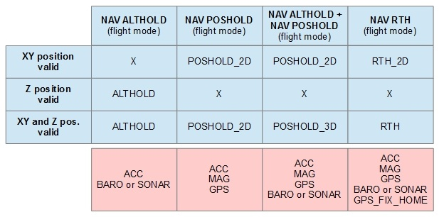
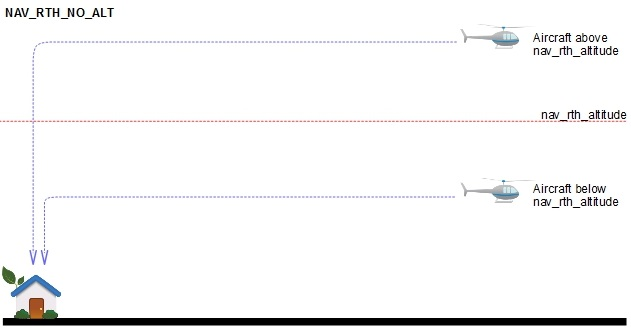
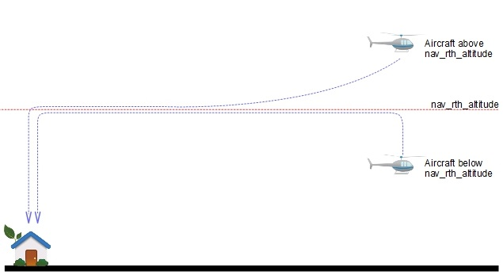
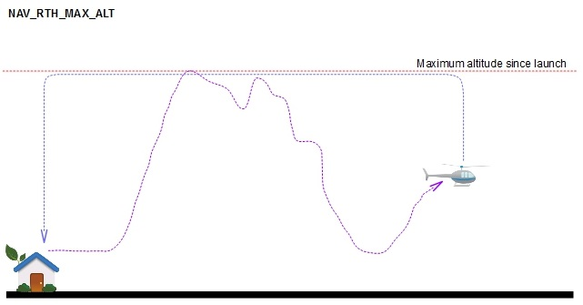
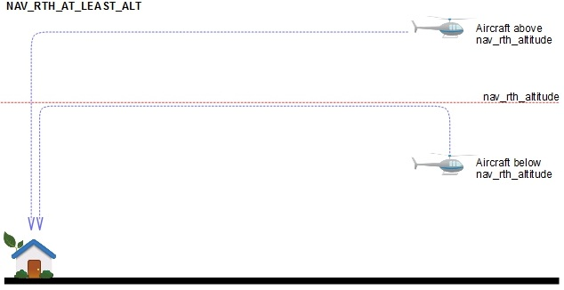

Navigation system can function in several modes: ALTHOLD, POSHOLD_2D, POSHOLD_3D, RTH, RTH_2D, WP. These modes are exposed to pilot as different flight modes or their combination: POSHOLD, ALTHOLD, RTH, WP. Lets have a look at each mode of operation in detail.

## ALTHOLD - Altitude hold

Roll, pitch and yaw inputs do not have any special meaning, their behaviour is determined by Cleanflight flight modes. Throttle input indicate climb or sink at a predetermined maximum rate.

Activated by **ALTHOLD** flight mode.

## POSHOLD_2D - Horizontal position hold

This mode is called 2D because only X and Y local coordinates are stabilised. Pitch and roll inputs control either lean angles or velocities in forward-right direction. Altitude (Z coordinate) is not stabilised.

Activated by **POSHOLD** flight mode.

## POSHOLD_3D - Full position hold

This mode is a combination of ALTHOLD and POSHOLD_2D modes. When sticks are centered, copter will maintain position and altitude.

Activated by **POSHOLD+ALTHOLD** flight modes.

## RTH and RTH_2D - Return to home

RTH and RTH_2D both will attempt to bring copter to launch position. Launch position is defined as a point where aircraft was ARMed. The only difference is that in RTH_2D mode machine will not maintain or control altitude. Throttle input goes straight to motors. Pilot can not manually choose between RTH and RTH_2D modes, firmware choose RTH or RTH_2D based on what sensors are available. RTH requires a position sensor and altitude sensor, while RTH_2D requires only position sensor

Activated by **RTH** flight mode.
There are many different modes for Altitude, see [further down on this page](https://github.com/iNavFlight/inav/wiki/7.-Navigation-modes#rth-altitude-control-modes)

## WP - Autonomous waypoint mission

This is a work in progress mode.

## HEADING LOCK

This flight mode affects on yaw axis and can be enabled together with any other flight mode. 
It helps to maintain current heading without pilots input and  magnetometer's support. When yaw stick is neutral position, Heading Lock tries to keep total amount on rotation on yaw at zero. When pilot moves yaw stick, Heading Lock is not used.
It is a equivalent of [TauLabs Axis Lock mode](https://github.com/TauLabs/TauLabs/wiki/Flightmode-Settings#axislock)
 
## Mode switch diagram

A diagram to indicate flight modes relation to navigation modes and illustrate sensor requirements:

# RTH Altitude control modes

RTH sequence can control altitude in several different ways, controlled by **nav_rth_alt_mode** and **nav_rth_altitude** parameters.

Default setting is NAV_RTH_AT_LEAST_ALT - climb to preconfigured altitude if below, stay at current altitude if above.

## Maintain current altitude (NAV_RTH_NO_ALT)
nav_rth_alt_mode = CURRENT

nav_rth_altitude is ignored

## Maintain current altitude + predefined safety margin (NAX_RTH_EXTRA_ALT)
nav_rth_alt_mode = EXTRA

nav_rth_altitude defines extra altitude margin

## Predefined altitude (NAV_RTH_CONST_ALT)
nav_rth_alt_mode = FIXED

nav_rth_altitude defines exact RTH altitude above launch point.

If the quadcopter is below nav_rth_altitude it will enter position hold and climb to desired altitude prior to flying back home. If the machine is above the desired altitude, it will turn and fly home and descend on the way.

## Maximum altitude since launch (NAV_RTH_MAX_ALT)
nav_rth_alt_mode = MAX

nav_rth_altitude is ignored

## At least predefined altitude above launch point (NAV_RTH_AT_LEAST_ALT)
nav_rth_alt_mode = AT_LEAST

nav_rth_altitude defines exact RTH altitude above launch point

