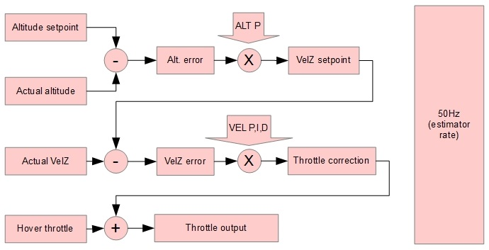
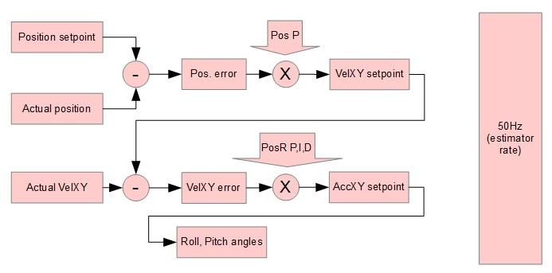

# Inertial position estimator (INAV)

Position estimator is a vital component for navigation subsystem. It takes data from all available sensors and fuses them together to figure out coordinates and velocities in the local frame of reference. All navigational decisions are made based on estimated position/velocity data. 

It is currently desined for multirotors.

## Priciple of operation

The key sensor for INAV is an accelerometer. Measured acceleration is translated from body-fixed frame to local NEU coordinates and integrated to yield velocities in North, East and Up directions. Velocity is further integrated to produce coordinates.

As accelerometer tend to drift, estimated velocities and coordinates tend to drift as well. This accumulated error is corrected from various reference sources - GPS, BARO, SONAR. Position estimator also maintains estimated position error for horizontal (X-Y) and vertical (Z) position.

When reference source is not available for some reason, estimated position error increases until it reaches a certain threshold. Beyond that threshold position is no longer updated and marked invalid until a valid reference source is available avain. This allows, for example, to fly through short (measured in seconds) GPS outages.

Using multiple sensors for estimation allows to filter noisy data (e.g. from barometer), interpolate between rare readings (e.g. from GPS), and immediately react on fast motion changes (using accelerometers) in the same time.

## Data soures

The following reference sources (with corresponding parameters for weight) are available for altitude and climb rate:

* Barometer - altitude (**inav_w_z_baro_p**)
* Barometer - velocity (**inav_w_z_baro_v**)
* Sonar - altitude (**inav_w_z_sonar_p**)
* Sonar - velocity (**inav_w_z_sonar_v**)
* GPS - altitude (**inav_w_z_gps_p**)
* GPS - velocity (**inav_w_z_gps_v**)

Sonar is optional source, it's only used when available and valid data received. GPS altitude is very noisy and is limited to FIXED_WING aircraft (experimental and untested).

The following reference sources (with corresponding parameters for weight) are available for position and velocity:

* GPS - position (**inav_w_xy_gps_p**)
* GPS - velocity (**inav_w_xy_gps_v**)

## Dead reckoning and handling sensor unavailability

* Enable dead reckoning (**inav_enable_dead_reckoning**)

* Dead reckoning - position (**inav_w_xy_dr_p**)
* Dead reckoning - velocity (**inav_w_xy_dr_v**)

* Velocity decay rate, XY-axis (**inav_w_xy_res_v**)
* Velocity decay rate, Z-axis (**inav_w_z_res_v**)

## Estimated position error thresholds

* Maximum acceptable position error (**inav_max_eph_epv**)
* Position error for SONAR sensor (**inav_sonar_epv**)
* Position error for BARO sensor (**inav_baro_epv**)

## GPS delay compensation

GPS data is not updated instantly. GPS module needs time to calculate new position and velocity. INAV has means of compensating for this delay. Expected GPS delay in milliseconds is controlled by **inav_gps_delay_ms** parameter. Typical value for GPS delay is 200ms.

# Position and altitude PID controllers

## PID regulators in ALTHOLD mode (Z-controller)

ALTHOLD mode uses two PIDs - **ALT** and **VEL**. Navigation Z-controller functional diagram is shown below:

### ALT PID
Actually ALT PID parameters control two P-controllers: Position-to-Velocity and Velocity-to-Acceleration

* **ALT_P** - defines how fast quad will attempt to compensate for altitude error, converts altitude error to desired vertical velocity (climb rate)
* **ALT_I** - not used
* **ALT_D** - not used

### VEL PID
This PID-controller is an Acceleration-to-Throttle controller

* **VEL_P** - defined how much throttle quad will add/reduce to achieve desired velocity
* **VEL_I** - controls compensation for hover throttle (and vertical air movement, thermals). This can be zero if hover throttle is precisely 1500us. Too much VEL I will lead to vertical oscillations, too low VEL I will cause drops or jumps when ALTHOLD is enabled, very low VEL I can result in total inability to maintain altitude
* **VEL_D** - acts as a dampener for acceleration. VEL D will resist any velocity change regardless of its nature (requested by VEL P and VEL I or induced by wind).

## PID regulators in POSHOLD/RTH/WP modes (XY-controller)

XY-controller uses two PIDs - **POS** and **POSR**

### POS PID
This is a Position-to-Velocity P-controller active in POSHOLD, RTH and WP modes

* **POS_P** - translates position error to desired velocity to reach the target
* **POS_I** - not used
* **POS_D** - not used

### POSR PID
Position rate PID-controller, controls Velocity-to-Acceleration

* **POSR_P** - controls acceleration to achieve desired velocity
* **POSR_I** - controls compensation for side wind or other disturbances. In totally calm air POSR I can be close to zero
* **POSR_D** - dampens response from P and I components; Tests indicate that this one can be zero at all times

Output of POSR PID-controller is desired acceleration which is directly translated to desired lean angles.

# Coordinate systems

Navigation operates in 3 different coordinate systems.

## LLH (Geographic) Coordinate System

Represents position on or above earth with a latitude, longitude and height value. Height is defined as altitude above the mean sea level.

## NEU Coordinate System

* The x axis is aligned with the vector to the north pole (tangent to meridians).
* The y axis points to the east side (tangent to parallels)
* The z axis points up from the center of the earth

This is a classical cartesian coordinate system where the 3 axes are orthogonal to each other.

# Frames of reference

## Global (geodetic) frame of reference

This frame of reference defines coordinates in LLH coordinate system. This frame of reference is not used directly by the code and is provided as an interface for defining waypoints and receiving reference data from GPS.

## Local frame of reference

This frame of reference defines coordinate in NEU coordinate system relative to a GPS Origin point. GPS origin is defined as a point where GPS fix with sufficient accuracy was firstly acquired. GPS Origin is usually a point of launch. Most calculations are done in this frame of reference.

## Body-fixed frame of reference

Attached to the aircraft.

* The x axis points in forward direction (as defined by geometry and not by movement) (roll axis)
* The y axis points to the right (geometrically) (pitch axis)
* The z axis points upwards (geometrically) (yaw axis)

This frame of reference is used to read sensor data and calculate lean angles. Usually the only operations in this frame of reference are coordinate transformations to/from local frame of reference.