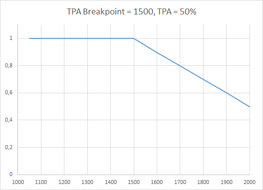

## PID Attenuation and scaling

**TPA** [***Throttle PID Attenuation***] is what allows vehicles, that are optimally tuned for hover or slow flight, dynamically adjust PID gains, so high throttle (fast forward flight or rapid climb) doesn't introduce oscillations.

### Multirotors

TPA applies a PID value reduction in relation to full Throttle. It is used to apply dampening of PID values as full throttle is reached.

**TPA** = % of dampening that will occur at full throttle.

**TPA Breakpoint** = the point in the throttle curve at which TPA will begin to be applied. Below that point PIDs are not attenuated at all.

#### How and Why to use this?

If you are getting oscillations starting at say 3/4 throttle, set TPA Breakpoint = 1750 or lower (remember, this is assuming your throttle range is 1000-2000), and then slowly increase TPA until your oscillations are gone. Usually, you will want TPA Breakpoint to start a little sooner then when your oscillations start so you'll want to experiment with the values to reduce/remove the oscillations.

#### Example of multirotor TPA curve

### Airplanes

Airplanes are different from multirotors as PID gains should be attenuated according to airspeed, not throttle. However, until airspeed sensor support is introduced it's safe to assume that speed is directly proportional to throttle.

For airplanes TPA works in a different way - it's not only attenuating PID gains at high throttle but also boosts them at low throttle allowing better control when gliding at low speeds with no throttle at all or slow flying with minimal throttle. TPA is expressed as a curve that boosts PIDs below TPA breakpoint and attenuates them above the breakpoint.

**TPA** = amount of TPA curve to apply to PIDs. 100% TPA allows PIDs to be scaled by factor in range [0.5; 2].

**TPA Breakpoint** = the point in the throttle curve at which PIDs are not attenuated

#### How to use this?

Tune your PIDs at throttle level you intend to fly your airplane (cruise throttle). Set that value as TPA Breakpoint.
You will notice that when you fly at lower throttle your airplane handles worse and at higher throttle (up to full throttle) it begins to oscillate. Increase TPA amount until these oscillations are gone or minimal. You will instantly notice better handling at lower throttle values.

#### Example of airplane TPA curve

